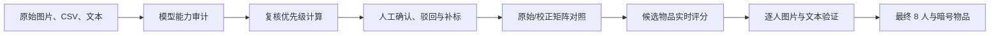

# VAST 2020 Mini-Challenge 2 多模态取证分析平台

[](https://vuejs.org/)
[](https://vitejs.dev/)
[](https://echarts.apache.org/)
[](https://pinia.vuejs.org/)

面向 IEEE VAST Challenge 2020 Mini-Challenge 2 的可解释分析与交互式复核系统。

本项目基于 [huyen-nguyen/VAST2020mc2](https://github.com/huyen-nguyen/VAST2020mc2) 的分析思路进行了工程化重构，将原始图片、YOLO v2 检测结果、图片描述文本、人工校正记录、人物-物品矩阵和最终结论组织为一条可回溯的证据链。

系统的目标不是在页面中写死某个物品或 8 人名单，而是回答以下赛题分析问题：

1. 原始目标检测模型是否足以直接支撑结论？
2. 在不知道误判答案的前提下，哪些 Person 应优先接受人工复核？
3. 人工校正前后，人物与物品的共现结构发生了什么变化？
4. 哪个候选物品最符合“由目标小组稳定共有”的暗号物品特征？
5. 最终结论能否下钻到每位成员的图片、文本和非成员排除证据？

---

## 1. 当前分析结论

在当前人工校正层、默认置信度阈值 `0.45` 和评分配置下，系统计算得到：

```text
暗号物品：canadaPencil

成员：
Person4
Person7
Person14
Person15
Person22
Person25
Person35
Person39
```

主要依据：

| 指标 | 当前结果 |
|---|---:|
| 目标组织规模 | 8 人 |
| `canadaPencil` 校正后拥有者 | 8 人 |
| 每位拥有者最少出现次数 | 2 次 |
| 稳定拥有者比例 | 100% |
| 当前阈值下证据图片 | 23 张 |
| 具有直接文本支持的成员 | 3 人 |
| 综合评分 | 0.9375 |

该结论由 `ForensicAnalysisEngine.analysis_summary()` 动态生成。修改人工校正记录、评分配置或置信度阈值后，候选图片证据、评分和排名会重新计算。

### 1.1 为什么不是 `yellowBag`

原始模型在阈值 `0.55` 下生成过一个非常有迷惑性的假设：

```text
yellowBag
8 位预测拥有者
12 个高置信度检测框
```

“恰好 8 人”看起来符合题目先验，但逐框人工复核后，12 个检测框全部被判定为误报。系统因此将该原始假设标记为：

```text
invalidated
```

这说明：

- 高置信度不等于分类正确；
- 人数恰好匹配不等于群体特征成立；
- 必须同时检查重复稳定性、图片证据、文本支持和非成员误检。

---

## 2. 从赛题角度理解项目

### 2.1 赛题本质

数据表面上是图片分类与目标检测问题，真正需要解决的是一个多模态取证问题：

```text
从 40 名候选人的图片和文本中，
识别一个由 8 人组成的小组，
并找出能够稳定区分该小组的共同物品。
```

困难不在于找到“模型预测过的物品”，而在于区分：

- 会场或生活场景中的普通公共物品；
- 模型偶然误判出的伪共现；
- 只出现一次、缺乏稳定性的弱线索；
- 被模型漏检，但经人工确认真实存在的关键物品；
- 真正由目标小组重复、稳定共有的暗号物品。

### 2.2 分析假设

本项目使用以下可检验假设组织分析：

1. **目标规模假设**：目标群体由 8 人构成。
2. **稳定性假设**：暗号物品不应只在每人一张图片中偶然出现。
3. **特异性假设**：拥有者人数越接近 8，越可能具有群体区分能力。
4. **多证据假设**：图片重复出现是主要证据，文本语义可作为交叉支持。
5. **反向验证假设**：必须解释模型为何把非成员误判为拥有者。
6. **人在回路假设**：模型输出只能产生复核候选，不能直接充当最终真值。

### 2.3 分析路径



---

## 3. 数据概况

当前本地数据统计如下：

| 数据项 | 数量 |
|---|---:|
| Person | 40 |
| Person 图片 | 907 |
| Person 检测 CSV | 907 |
| Person 文本文件 | 193 |
| 图片 caption 文件 | 171 |
| 独立文本文件 | 22 |
| 训练图片 | 516 |
| 人员图片与训练图片合计 | 1423 |
| 有效原始检测框 | 4417 |
| 训练类别 | 43 |
| 原始预测实际输出类别 | 22 |
| 模型未输出类别 | 21 |

### 3.1 原始文件组织

每位 Person 的目录包含若干组多模态文件：

```text
PersonX_N.jpg
PersonX_N.csv
PersonX_Ncaption.txt
PersonX_textN.txt
```

其中：

- `.jpg` 是原始图片；
- `.csv` 是 YOLO v2 边界框、标签和置信度；
- `caption.txt` 是图片描述；
- `textN.txt` 是与该 Person 相关的独立文本。

---

## 4. 三层数据设计

系统严格区分原始预测、人工校正和推断结果，防止人工操作直接污染原始数据。

### 4.1 原始预测层

文件：

```text
raw_data/i3_new_data.json
```

包含：

- Person 与图片索引；
- 图片静态路径；
- caption 和独立文本；
- YOLO 检测框；
- 标签与置信度；
- 损坏数据标记。

该文件作为只读输入使用。人工复核不会覆盖其中的标签和分数。

### 4.2 人工校正层

文件：

```text
raw_data/human_corrections.json
```

包含：

- `target_group_size`：题目先验中的目标人数；
- `candidate_scoring`：候选评分权重与惩罚配置；
- `corrected_labels`：人工确认后的候选物品分布；
- `rejected_predictions`：被驳回的原始检测框；
- `audit_log`：确认、补标、修改、恢复和驳回操作记录。

评分配置当前为：

```json
{
  "specificity_weight": 0.4,
  "stability_weight": 0.35,
  "visual_weight": 0.15,
  "text_weight": 0.1,
  "non_target_penalty": 0.72,
  "visual_images_per_owner": 2
}
```

这些参数由后端读取并返回前端，不在评分组件中写死。

### 4.3 推断结果层

文件：

```text
raw_data/analysis_results.json
```

可通过分析流水线或导出接口重新生成，包含：

- 模型审计结果；
- 失效的原始假设；
- 候选物品排名；
- 当前评分配置；
- 最终暗号物品和成员；
- 逐人图片与文本证据；
- 非成员排除证据；
- 分析阶段及数据来源。

---

## 5. 五阶段赛题分析流程

前端使用五个页面对应五个分析阶段。页面不是彼此独立的图表集合，而是同一条证据链的连续步骤。

### 5.1 第一阶段：模型不确定性审计

路由：

```text
/task1_auditing
```

分析目标：

> 在寻找答案之前，先确定自动检测结果能信到什么程度。

主要分析：

- 训练类别与实际输出类别覆盖；
- 各标签置信度分布；
- 检测框空间分布；
- 人员级 Precision、Recall 和 F1；
- 不同阈值对候选拥有者人数的影响；
- `yellowBag` 原始假设的复核状态。

当前 `canadaPencil` 人员级阈值曲线：

| 阈值 | Precision | Recall | F1 | 预测拥有者 |
|---:|---:|---:|---:|---:|
| 0.25 | 0.1935 | 0.7500 | 0.3077 | 31 |
| 0.35 | 0.3636 | 0.5000 | 0.4211 | 11 |
| 0.45 | 0.6667 | 0.5000 | **0.5714** | 6 |
| 0.55 | 0.0000 | 0.0000 | 0.0000 | 1 |
| 0.65 | 0.0000 | 0.0000 | 0.0000 | 0 |
| 0.75 | 0.0000 | 0.0000 | 0.0000 | 0 |

因此默认工作阈值设为 `0.45`。它是当前离散测试点中 F1 最高的阈值，不代表适用于所有数据的固定最优值。用户仍可通过滑块切换阈值：

- 较低阈值：保留更多候选，提高召回，但误报更多；
- 较高阈值：保留更可靠的检测，但可能丢失真实成员。

### 5.2 第二阶段：人工复核与图文校准

路由：

```text
/task2_correction
```

分析目标：

> 在尚不知道哪些预测是误判时，先用复核前可获得的异常信号决定检查顺序。

系统不会使用“已经知道最终误判”的结果为人工复核排序。`person_review_priorities()` 只使用原始图片元数据和未经人工修正的 YOLO 输出。

复核优先级由以下信号组成：

| 信号 | 规则 | 最高贡献 |
|---|---|---:|
| 不确定性 | 置信度低于 0.35 的检测比例 | 35 |
| 框冲突 | 不同类别检测框 IoU ≥ 0.45 | 25 |
| 覆盖缺口 | 图片没有有效检测 | 20 |
| 标签不稳定 | 同一 Person 的标签过于分散 | 15 |
| 数据质量 | 图片或 CSV 损坏、解析异常 | 20 |

当前策略：

- 对 40 人计算异常分；
- 推荐前 25%，即 10 人进入重点复核；
- 其中前 5 人标记为高优先级；
- 前端每 10 秒刷新复核优先级；
- 点击 Person 后进入推荐图片和检测框；
- 用户在画布中执行确认、修改、补标、驳回或恢复。

人工操作通过：

```text
POST /api/update_label
```

写入独立校正层。操作完成后，系统会重新获取：

- 分析摘要；
- 复核队列；
- 复核优先级；
- 原始和校正矩阵；
- 模型审计数据；
- 候选排名和最终结果。

### 5.3 第三阶段：人物-物品共现聚类

路由：

```text
/task3_clustering
```

分析目标：

> 从单个预测框转向整体结构，观察哪些物品集中在稳定的小群体中。

系统提供两套人物-物品矩阵。

#### 原始预测矩阵

对 Person `p` 和物品 `i`：

```text
R(p, i, τ) =
满足 label=i、score≥τ、且未被人工驳回的原始检测数量
```

特点：

- 受当前阈值影响；
- 保留模型的不确定性；
- 已驳回误报不会再次进入矩阵；
- 用于观察校正前结构。

#### 人工校正矩阵

```text
C(p, i) = corrected_occurrence_count(p, i)
```

特点：

- 直接读取人工校正分布；
- 包含模型漏检后的人工补标；
- 不因原始模型阈值变化而丢失已确认事实；
- 用于最终候选筛选。

#### Ward 重排

系统分别对人员轴和物品轴执行：

```text
欧氏距离 + Ward 层次聚类
```

聚类只改变矩阵展示顺序，帮助发现块状结构，不直接决定最终成员。

页面同时展示：

- 原始矩阵与校正矩阵；
- 同一候选校正前后的拥有者变化；
- 候选拥有者人数与稳定率分布；
- 证据图片数量对应的点大小；
- 点击候选后与第四页评分联动。

### 5.4 第四阶段：候选暗号物品评分

路由：

```text
/task4_totem
```

分析目标：

> 将“看起来像一个群体”转化为可以解释、比较和重新计算的候选评分。

#### 人数特异性

```text
specificity =
max(0, 1 - |owner_count - target_group_size| / target_group_size)
```

拥有者人数越接近目标规模，得分越高。

#### 重复稳定性

```text
stability =
出现次数至少为 2 的拥有者人数 / 拥有者总人数
```

该指标避免将“每人只出现一次”的偶然共现误认为稳定暗号。

#### 图片证据

项目共有 907 张 Person 图片，但全量图片数不能直接作为任何候选的证据数。图片数据被严格拆成：

```text
人工核验图片：
human_corrections.json 中可追溯的 image_ids
用于图片评分

原始模型命中图片：
当前阈值下、未被人工驳回的 YOLO 检测图片
只用于模型对照，不进入图片评分
```

归一化公式：

```text
visual =
min(1, verified_image_count / (owner_count × visual_images_per_owner))
```

当前配置将“平均每位拥有者 2 张证据图”视为图片项满分。

这种拆分避免使用模型自身的预测再次证明模型正确。例如阈值 `0.45` 下，`blueSunglasses` 有 18 张原始模型命中图片，但没有记录具体人工核验图片，因此其图片贡献必须为 0。

#### 文本支持

```text
text =
具有直接文本命中的拥有者人数 / 拥有者总人数
```

文本按支持人数计分，同时返回命中文本条数供核查。文本通过严格的受控别名匹配，例如：

- `canada pencil`
- `canadian pencil`
- `maple leaf pencil`
- `souvenir from canada`

泛化词不会自动作为直接支持。例如 `blueSunglasses` 只匹配 `blue sunglasses`，不会将所有只出现 `sunglasses` 的文本都计入。

#### 综合评分

评分公式由 API 返回的配置实时构造：

```text
score =
specificity × 40%
+ stability × 35%
+ visual × 15%
+ text × 10%
```

如果拥有者人数不等于目标规模：

```text
score = score × 72%
```

第四页会同时展示：

- 每个候选的堆叠贡献；
- 当前使用的置信度阈值；
- 后端返回的评分权重；
- 每项原始指标；
- 归一化值；
- 惩罚系数；
- 每项对最终分数的真实贡献。

#### 实时更新

阈值变化时：

```text
阈值改变
  -> GET /api/analysis_summary?score_threshold=新阈值
  -> 重新筛选原始模型命中图片
  -> 更新模型命中对照
  -> 更新第一层指标和第三层原始矩阵
```

人工核验图片和候选评分不会因为模型阈值变化而改变。它们只在以下数据变化时重算：

```text
人工确认、补标、修改、驳回或恢复
candidate_scoring 配置变化
corrected_labels 分布变化
```

模型命中对照会实时变化，例如：

| 候选 | 阈值 0.25 模型命中 | 阈值 0.45 模型命中 | 阈值 0.75 模型命中 |
|---|---:|---:|---:|
| `canadaPencil` | 17 | 2 | 0 |
| `blueSunglasses` | 97 | 18 | 0 |
| `lavenderDie` | 31 | 11 | 3 |
| `metalKey` | 41 | 12 | 0 |

这些数值描述的是模型检测行为，不是已确认的图片证据。

#### 当前阈值 0.45 下的候选排名

| 排名 | 候选 | 拥有者 | 稳定率 | 人工核验图片 | 模型命中图片 | 直接文本 | 综合分 |
|---:|---|---:|---:|---:|---:|---:|---:|
| 1 | `canadaPencil` | 8 | 100% | 23 | 2 | 3 人 / 3 条 | 0.9375 |
| 2 | `blueSunglasses` | 9 | 100% | 0 | 18 | 2 人 / 2 条 | 0.5200 |
| 3 | `rainbowPens` | 8 | 0% | 0 | 0 | 0 人 / 0 条 | 0.4000 |
| 4 | `rubiksCube` | 8 | 0% | 0 | 0 | 0 人 / 0 条 | 0.4000 |
| 5 | `noisemaker` | 9 | 0% | 0 | 4 | 2 人 / 2 条 | 0.2680 |
| 6 | `lavenderDie` | 9 | 0% | 0 | 11 | 1 人 / 1 条 | 0.2600 |
| 7 | `pinkEraser` | 9 | 0% | 0 | 0 | 1 人 / 1 条 | 0.2600 |
| 8 | `metalKey` | 10 | 0% | 0 | 12 | 0 人 / 0 条 | 0.2160 |
| 9 | `miniCards` | 10 | 0% | 0 | 0 | 0 人 / 0 条 | 0.2160 |

人工核验图片为 0 表示校正层没有保存可追溯 `image_ids`。系统不会将原始模型命中或 `occurrence_count` 冒充人工图片证据。

#### 最终候选硬条件

综合分用于排序，但最终候选还必须先满足：

```text
owner_count == target_group_size
min_occurrence >= 2
```

也就是说，“分数最高”不是唯一条件。当前只有 `canadaPencil` 同时满足目标人数和最低重复次数要求。

### 5.5 第五阶段：逐人证据验证与最终定案

路由：

```text
/task5_verdict
```

分析目标：

> 将群体级结论下钻到每一位成员，并同时说明为什么其他人不属于该组。

最终成员证据：

| Person | 人工确认图片 | 次数 | 原始模型曾检出 | 最高模型分 | 文本支持 |
|---|---|---:|---|---:|---:|
| Person4 | 22, 23, 24 | 3 | 是 | 0.5179 | 0 |
| Person7 | 1, 15 | 2 | 是 | 0.4634 | 0 |
| Person14 | 8, 9, 10, 16, 17 | 5 | 是 | 0.4547 | 1 |
| Person15 | 1, 2 | 2 | 否，人工补标 | 0 | 0 |
| Person22 | 3, 5 | 2 | 否，人工补标 | 0 | 0 |
| Person25 | 9, 10, 11 | 3 | 是 | 0.4525 | 0 |
| Person35 | 7, 8 | 2 | 是 | 0.2795 | 1 |
| Person39 | 3, 4, 11, 12 | 4 | 是 | 0.3359 | 1 |

其中 Person15 和 Person22 是重要的模型漏检案例。如果只使用原始预测，它们会被错误排除。

第五页包括：

- 最终候选与综合分；
- 8 位成员关系视图；
- 人物-证据矩阵；
- 每位成员的全部核验图片；
- 模型命中与人工补标标识；
- caption 和独立文本；
- 非成员模型误检条形图；
- 原始预测、人工校正和最终推断的来源说明。

#### 非成员反向验证

`exclusion_evidence()` 查找：

```text
不在最终组中
但原始模型曾预测其拥有 canadaPencil
```

当前最高的非成员误检包括：

| Person | 最高置信度 | 图片 |
|---|---:|---|
| Person3 | 0.5706 | Person3_8 |
| Person23 | 0.4812 | Person23_34 |
| Person9 | 0.4259 | Person9_2 |
| Person32 | 0.4026 | Person32_47 |
| Person37 | 0.3977 | Person37_1 |

这些记录用于回答“为什么模型认为他是成员，但人工证据没有确认”。

---

## 6. 实时因果链

系统中的关键交互会重新触发后端分析，而不是只修改前端展示。

### 6.1 修改置信度阈值

```text
setScoreThreshold()
  -> 重算原始矩阵
  -> 请求原始/校正矩阵快照
  -> 请求带 score_threshold 的 analysis_summary
  -> 动态汇总候选的原始模型命中图片
  -> 保持人工核验图片和候选评分不变
  -> 更新模型审计、矩阵和评分页对照信息
```

### 6.2 提交人工复核

```text
POST /api/update_label
  -> 写入 human_corrections.json
  -> 重建分析引擎
  -> 重算候选分布
  -> 重算复核队列
  -> 重算复核优先级
  -> 重算矩阵
  -> 重算候选评分
  -> 重算最终结果
```

### 6.3 切换原始/校正矩阵

```text
原始预测：
使用当前阈值和 rejected_predictions

人工校正：
使用 corrected_labels 和 occurrence_count
```

切换只改变观察的数据层，不会混合或覆盖两种数据。

---

## 7. 系统架构

```text
Vue 3 + Pinia + ECharts
          |
          | Axios / JSON API
          v
Flask API
          |
          v
ForensicAnalysisEngine
  |-- 模型审计
  |-- 复核优先级
  |-- 原始/校正矩阵
  |-- Ward 重排
  |-- 候选评分
  |-- 逐人证据
  `-- 非成员排除
          |
          v
i3_new_data.json
human_corrections.json
analysis_results.json
MC2-Image-Data/
```

### 7.1 技术栈

前端：

- Vue 3
- Vite 5
- Pinia
- Vue Router
- Axios
- ECharts 6
- D3

后端：

- Python 3
- Flask
- Flask-CORS
- NumPy
- Pandas
- SciPy

---

## 8. 项目结构

```text
vast-2020-mc2/
├── README.md
├── challenge_analysis/
│   ├── run_pipeline.py
│   ├── data_cleaner.py
│   ├── text_mining.py
│   ├── model_auditor.py
│   ├── community_clustering.py
│   └── totem_elimination.py
├── backend_service/
│   ├── app.py
│   ├── config.py
│   ├── requirements.txt
│   ├── test_analysis.py
│   └── core_engines/
│       ├── analysis_engine.py
│       ├── data_provider.py
│       └── cluster_engine.py
├── frontend_client/
│   ├── package.json
│   ├── vite.config.js
│   ├── dist/
│   └── src/
│       ├── App.vue
│       ├── router/
│       ├── store/
│       ├── assets/
│       ├── views/
│       └── components/
├── raw_data/
│   ├── i3_new_data.json
│   ├── human_corrections.json
│   ├── analysis_results.json
│   └── MC2-Image-Data/
│       ├── Person1 ... Person40
│       └── TrainingImages/
└── others/
```

关键模块：

| 模块 | 职责 |
|---|---|
| `analysis_engine.py` | 模型审计、矩阵、评分、证据与最终推断 |
| `data_provider.py` | 原始数据读取、校正层持久化和审计日志 |
| `dashboard.js` | 前端全局状态、API 调用和实时重算链路 |
| `PersonReviewRadar.vue` | 复核前 Person 优先级 |
| `ClusterHeatmap.vue` | 原始/校正人物-物品矩阵 |
| `ClusterSignalMap.vue` | 人数、稳定率和图片证据候选空间 |
| `CandidateRankingChart.vue` | API 驱动的实时评分拆解 |
| `EvidencePhotoGallery.vue` | 最终逐人图片证据 |
| `ExclusionChart.vue` | 非成员模型误检反向验证 |

---

## 9. 后端 API

默认地址：

```text
http://localhost:5000
```

### 9.1 模型审计

```http
GET /api/model_evaluation
```

返回：

- 类别置信度统计；
- 训练类别和实际输出类别；
- 缺失类别；
- Precision、Recall 和 F1；
- 阈值曲线；
- 检测框空间分布；
- 原始假设对照标签。

### 9.2 人物-物品矩阵

```http
POST /api/distribution_matrix
Content-Type: application/json
```

原始矩阵请求：

```json
{
  "data_source": "raw",
  "score_threshold": 0.45,
  "excluded_items": []
}
```

校正矩阵请求：

```json
{
  "data_source": "corrected",
  "excluded_items": []
}
```

### 9.3 分析摘要与候选排名

```http
GET /api/analysis_summary?score_threshold=0.45
```

返回：

- `raw_hypothesis`
- `candidate_rankings`
- `candidate_scoring`
- `final`
- `stages`

`score_threshold` 只影响 `raw_detection_image_count` 和原始模型矩阵，不改变人工核验图片数及其图片贡献分。

### 9.4 人工复核队列

```http
GET /api/review_queue?label=blueSunglasses&score_threshold=0.45
```

队列按候选动态生成，不再固定为最终候选与 `yellowBag`：

- `verified`：已经写入校正层的具体图片；
- `model_hit`：当前阈值下该候选的模型命中，等待确认或驳回；
- `evidence_search`：候选拥有者的其他图片，用于人工寻找模型漏检证据。

第二层可以切换全部候选。确认无检测框图片时会执行人工补标；选择“该图无此物品”会记录 `dismiss` 操作，而不会伪造误报检测框。

默认使用渐进式“智能批次”，不会要求分析师一次检查 907 张图片：

- 已核验图片和当前阈值模型命中始终显示；
- 直接 caption 命中优先；
- 低于工作阈值的同类检测其次；
- 无检测图片和数据异常图片作为漏检搜索候选；
- 每位候选拥有者每批最多返回 3 张搜索图片；
- 可通过“上一批 / 下一批”逐步扩大覆盖；
- “查看全部”仅作为完整审计入口。

当前首批规模示例：

| 候选 | 智能首批 | 全量队列 |
|---|---:|---:|
| `canadaPencil` | 51 | 134 |
| `blueSunglasses` | 58 | 211 |
| `rainbowPens` | 21 | 241 |
| `rubiksCube` | 24 | 216 |

### 9.5 复核优先级

```http
GET /api/review_priorities
```

返回每位 Person 的：

- 综合异常分；
- 优先级；
- 分项贡献；
- 推荐图片；
- 推荐检测框；
- 可解释原因。

### 9.6 提交人工校正

```http
POST /api/update_label
Content-Type: application/json
```

示例：

```json
{
  "person_id": "Person15",
  "image_id": "Person15_1",
  "box_id": -1,
  "action": "add",
  "new_label": "canadaPencil",
  "difficult": false,
  "note": "人工视觉确认模型漏检"
}
```

支持的动作：

| 动作 | 含义 |
|---|---|
| `confirm` | 确认原始检测 |
| `add` | 添加模型漏检标签 |
| `modify` | 驳回旧标签并写入新标签 |
| `reject` | 驳回原始预测 |
| `delete` | 删除校正记录 |
| `restore` | 恢复被驳回的预测 |

### 9.7 导出分析结果

```http
GET /api/export_analysis
```

输出：

```text
raw_data/analysis_results.json
```

---

## 10. 环境要求

建议环境：

```text
Python >= 3.10
Node.js >= 18
npm >= 9
```

### 10.1 安装 Python 依赖

Windows PowerShell：

```powershell
cd D:\vast-2020-mc2
python -m venv .venv
.\.venv\Scripts\Activate.ps1
python -m pip install -r backend_service\requirements.txt
```

macOS / Linux：

```bash
cd /path/to/vast-2020-mc2
python3 -m venv .venv
source .venv/bin/activate
python -m pip install -r backend_service/requirements.txt
```

### 10.2 安装前端依赖

```powershell
cd D:\vast-2020-mc2\frontend_client
npm install
```

---

## 11. 运行项目

需要分别启动 Flask 后端和 Vite 前端。

### 11.1 启动后端

```powershell
cd D:\vast-2020-mc2\backend_service
python app.py
```

默认地址：

```text
http://localhost:5000
```

健康检查可使用：

```powershell
Invoke-RestMethod http://localhost:5000/api/analysis_summary
```

### 11.2 启动前端

另开一个终端：

```powershell
cd D:\vast-2020-mc2\frontend_client
npm run dev -- --host 0.0.0.0 --port 5173 --strictPort
```

浏览器访问：

```text
http://localhost:5173
```

`--strictPort` 可以避免 Vite 在 5173 被占用时静默切换到其他端口。

### 11.3 修改 API 地址

默认 API：

```text
http://localhost:5000/api
```

可通过环境变量覆盖：

```powershell
$env:VITE_API_BASE = "http://localhost:5000/api"
npm run dev
```

### 11.4 执行离线分析流水线

```powershell
cd D:\vast-2020-mc2
python challenge_analysis\run_pipeline.py
```

流水线依次执行：

1. 模型审计；
2. 校正矩阵生成；
3. 候选排名；
4. 最终结果导出。

它不会覆盖原始预测快照。

---

## 12. 测试与构建

### 12.1 后端回归测试

```powershell
cd D:\vast-2020-mc2\backend_service
python -m unittest test_analysis.py
```

当前测试覆盖：

- `yellowBag` 原始假设被完整否定；
- 最终组由候选规则动态生成；
- 候选四项贡献之和等于综合分；
- 非最终候选也能动态获取图片证据；
- 不同阈值会重新计算图片证据和候选分数；
- 原始与校正矩阵 API 均可用；
- 复核队列包含真实边界框；
- Person 复核优先级不使用人工校正答案。

### 12.2 前端生产构建

```powershell
cd D:\vast-2020-mc2\frontend_client
npm run build
```

输出：

```text
frontend_client/dist/
```

### 12.3 推荐验证顺序

```text
1. 后端单元测试
2. 前端生产构建
3. 打开第一层并切换阈值
4. 检查第三层原始矩阵是否变化
5. 检查第四层图片证据和评分是否变化
6. 在第二层提交一条人工复核
7. 检查第三、第四、第五层是否同步更新
```

---

## 13. 如何复现实验结论

### 13.1 复现模型审计

```powershell
cd D:\vast-2020-mc2
python challenge_analysis\model_auditor.py
```

应观察到：

- 43 个训练类别；
- 22 个实际输出类别；
- 21 个缺失类别；
- `yellowBag` 高阈值假设为 `invalidated`。

### 13.2 复现校正矩阵

```powershell
python challenge_analysis\community_clustering.py
```

脚本读取 `human_corrections.json`，构造校正矩阵并执行 Ward 重排。

### 13.3 复现候选排名

```powershell
python challenge_analysis\totem_elimination.py
```

结果写入：

```text
raw_data/analysis_results.json
```

### 13.4 验证结果没有写死

可以采用以下实验：

1. 修改 `human_corrections.json` 中某候选的 `occurrence_count`；
2. 修改 `candidate_scoring` 权重；
3. 调整前端阈值；
4. 重新调用 `/api/analysis_summary`；
5. 对比候选图片证据、分项贡献、综合分和排名。

前端只消费 API 返回值，不维护一份独立的候选结果常量。

---

## 14. 设计原则

### 14.1 不把模型置信度当作真值

置信度只表示模型内部确信程度。它不能替代图片复核，也不能证明标签正确。

### 14.2 不把“恰好 8 人”当作充分条件

人数匹配只是特异性证据。稳定重复、图片数量和文本支持同样重要。

### 14.3 人工复核必须从未知状态开始

复核优先级只能使用复核前信号，不能使用最终成员或已知误判作为输入。

### 14.4 原始层与校正层必须可对照

所有人工修改写入独立文件，原始预测始终保留，便于解释结论如何发生变化。

### 14.5 正向证据与反向证据同时展示

既要说明成员为什么属于该组，也要说明模型误检的非成员为什么被排除。

### 14.6 图表必须对应真实数据

系统不使用随机点、模拟社交边或前端硬编码分数填充视觉组件。

---

## 15. 已知边界

1. 目标组织规模 8 来自赛题先验，不是系统自动估计结果。
2. 候选分数是可解释启发式评分，不是经过监督学习拟合的概率。
3. 当前默认阈值 0.45 是离散测试点中的 F1 最优值，不保证对其他数据集最优。
4. 文本支持使用受控别名匹配，不是完整的实体链接或语义推理模型。
5. 部分候选的人工分布只有人员和出现次数，尚未补齐全部人工图片 ID。
6. 原始模型命中图片会随阈值变化，但只作为对照，不进入图片评分。
7. 原始数据没有可靠的人际社交边，系统不生成模拟社交网络来证明群体关系。
8. ECharts 相关生产包较大，Vite 可能提示单个 chunk 超过 500 kB；不影响分析正确性。
9. Flask 当前为分析开发配置，部署到生产环境时应关闭 `DEBUG` 并使用正式 WSGI 服务。

---

## 16. 后续可扩展方向

- 使用 ROC、PR 曲线或交叉验证自动选择阈值；
- 对评分权重执行敏感性分析；
- 为全部候选补齐图片级人工证据；
- 引入图像嵌入或视觉语言模型辅助复核；
- 使用更完整的实体链接方法处理文本别名；
- 增加操作用户、时间戳和校正版本号；
- 将候选排名和最终结果保存为可比较的分析版本；
- 为 ECharts 和路由实施更细粒度代码拆分；
- 增加端到端浏览器测试，覆盖阈值和人工复核联动。

---

## 17. 项目来源与致谢

本项目是对以下开源项目和公开分析思路的重构与扩展：

- [huyen-nguyen/VAST2020mc2](https://github.com/huyen-nguyen/VAST2020mc2)
- [TTU Nguyen MC2 可视化分析](https://huyen-nguyen.github.io/VAST2020mc2/TTU-Nguyen-MC2/)
- [VAST Challenge 2020 MC2 社区页面](https://vacommunity.org/VAST+Challenge+2020+MC2)

重构重点包括：

- 前后端数据接口统一；
- 原始预测与人工校正分层；
- 复核前 Person 优先级；
- 可持久化人工复核；
- 原始/校正矩阵对照；
- API 驱动的实时候选评分；
- 逐人图片和文本证据；
- 非成员反向验证；
- 可复现测试与分析流水线。

---

## 18. 结论

本项目对赛题的核心判断不是：

```text
模型在哪 8 个人身上检测到了同一个物品？
```

而是：

```text
在模型存在漏检和误报的情况下，
哪个物品经过人工校正后仍恰好由 8 人稳定共有，
并且能够由重复图片、文本和非成员排除证据共同支持？
```

当前数据给出的答案是：

```text
canadaPencil

Person4, Person7, Person14, Person15,
Person22, Person25, Person35, Person39
```

更重要的是，这个答案可以从原始预测、人工校正、候选评分和逐人证据中逐步重算，而不是由前端页面预先写死。
