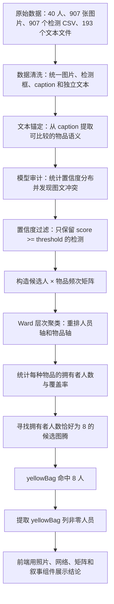

# VAST Challenge 2020 MC2 多模态取证分析平台

本项目面向 **IEEE VAST Challenge 2020 Mini-Challenge 2**，围绕 40 名候选人的图像、YOLO v2 检测结果、图片说明文本和独立文本记录，构建了一套从模型审计、人工复核、群体聚类、公共物品排除到最终嫌疑群体判定的五层可视分析流程。

项目的核心目标不是直接相信自动识别结果，而是回答以下问题：

1. 原始目标检测模型有哪些不确定性和误报？
2. 图像识别与文本描述发生冲突时，应该优先复核哪些样本？
3. 如何把 40 名候选人与其持有物品转换成可比较的结构化矩阵？
4. 哪些物品只是会场公共物资，哪些物品能够稳定区分一个小群体？
5. 如何从物品共现关系中得到最终 8 人名单？
6. 前端的每一层可视化分别对应哪段计算代码？

---

## 1. 最终结论

项目离线分析流水线在置信度阈值 `0.55` 下得到：

```text
秘密图腾物品：yellowBag（黄色提袋）

核心嫌疑群体：
Person3
Person7
Person9
Person10
Person12
Person17
Person32
Person38
```

集合形式为：

```text
Hacker Group =
{Person3, Person7, Person9, Person10,
 Person12, Person17, Person32, Person38}
```

得到该结论的直接计算依据是：

- 共有 40 名候选人；
- 只保留 YOLO 置信度不低于 `0.55` 的有效检测框；
- 将检测结果汇总为“候选人 × 物品”的频次矩阵；
- 对每个物品统计至少拥有一次该物品的人数；
- `yellowBag` 恰好由 8 人持有，覆盖率为 `8 / 40 = 20%`；
- 读取 `yellowBag` 列中数值大于 0 的行，得到最终 8 人。

需要特别说明：代码中的“8 人”是一个显式分析先验。`totem_elimination.py` 使用 `owners == 8` 寻找图腾物品，并不是聚类算法自行推断组织人数。

---

## 2. 项目核心思想

项目采用一条漏斗式证据链：



从实现角度看，项目分为三层：

| 层级 | 目录 | 职责 |
|---|---|---|
| 离线分析层 | `challenge_analysis/` | 清洗原始数据、文本锚定、模型审计、矩阵构造、聚类和最终筛选 |
| 后端服务层 | `backend_service/` | 加载分析快照、提供模型统计、动态矩阵和人工修正接口 |
| 前端可视化层 | `frontend_client/` | 用 Vue、ECharts 和 D3 展示五层渐进式分析过程 |

---

## 3. 技术栈

### 3.1 数据分析

- Python
- pandas
- NumPy
- SciPy
- JSON

### 3.2 后端

- Flask
- Flask-CORS

### 3.3 前端

- Vue 3
- Vue Router
- Pinia
- Axios
- ECharts
- D3
- Vite

---

## 4. 数据集与输入结构

原始数据位于：

```text
raw_data/MC2-Image-Data/
```

当前仓库包含：

| 数据类型 | 数量 |
|---|---:|
| 候选人目录 | 40 |
| JPG 图片 | 907 |
| YOLO 检测 CSV | 907 |
| TXT 文本 | 193 |

每个人的目录大致如下：

```text
raw_data/MC2-Image-Data/Person3/
├── Person3_1.jpg
├── Person3_1.csv
├── Person3_1caption.txt
├── Person3_2.jpg
├── Person3_2.csv
├── Person3_2caption.txt
└── ...
```

其中：

- `*.jpg` 是原始图片；
- `*.csv` 是赛题提供的 YOLO v2 检测框；
- `*caption.txt` 是对应图片的文本说明；
- 不含 `caption` 的 TXT 文件作为候选人的独立文本记录。

CSV 中主要使用以下字段：

| 字段 | 含义 |
|---|---|
| `x` | 检测框横坐标 |
| `y` | 检测框纵坐标 |
| `Width` | 检测框宽度 |
| `Height` | 检测框高度 |
| `Score` | YOLO 置信度 |
| `Label` | 识别出的物品标签 |

---

## 5. 项目结构

```text
vast-2020-mc2/
├── README.md
│
├── challenge_analysis/
│   ├── run_pipeline.py
│   ├── data_cleaner.py
│   ├── text_mining.py
│   ├── model_auditor.py
│   ├── community_clustering.py
│   └── totem_elimination.py
│
├── backend_service/
│   ├── app.py
│   ├── config.py
│   ├── requirements.txt
│   └── core_engines/
│       ├── data_provider.py
│       └── cluster_engine.py
│
├── frontend_client/
│   ├── package.json
│   ├── vite.config.js
│   ├── index.html
│   ├── dist/
│   └── src/
│       ├── App.vue
│       ├── main.js
│       ├── router/
│       │   └── index.js
│       ├── store/
│       │   └── dashboard.js
│       ├── views/
│       │   ├── ModelAuditingView.vue
│       │   ├── DataExplorationView.vue
│       │   ├── CommunityClusteringView.vue
│       │   ├── TotemFilterView.vue
│       │   └── CyberForensicsView.vue
│       ├── components/
│       │   ├── auditing/
│       │   ├── interaction/
│       │   ├── process/
│       │   └── targeting/
│       └── utils/
│           └── chartTheme.js
│
└── raw_data/
    ├── MC2-Image-Data/
    │   ├── Person1/
    │   ├── ...
    │   ├── Person40/
    │   └── TrainingImages/
    └── i3_new_data.json
```

`raw_data/i3_new_data.json` 是运行离线流水线后生成的主数据快照。后端和部分前端图表都依赖该文件。

---

## 6. 完整计算分析过程

### 6.1 总调度入口

文件：

```text
challenge_analysis/run_pipeline.py
```

主函数 `execute_full_pipeline()` 依次执行：

```python
run_data_cleaner(RAW_DATA_DIR, MASTER_JSON)
run_text_mining(MASTER_JSON)
run_model_auditor(MASTER_JSON)
run_totem_elimination(MASTER_JSON)
```

其中 `run_totem_elimination()` 内部还会调用 `run_community_clustering()`，所以完整顺序是：

```text
数据清洗
  -> 文本挖掘
  -> 模型审计
  -> 共现矩阵与层次聚类
  -> 图腾物品筛选
  -> 8 人名单输出
```

路径使用相对路径：

```python
RAW_DATA_DIR = "../raw_data/MC2-Image-Data"
MASTER_JSON = "../raw_data/i3_new_data.json"
```

因此必须从 `challenge_analysis/` 目录运行 `run_pipeline.py`。

---

### 6.2 Step 1：原始数据清洗

文件：

```text
challenge_analysis/data_cleaner.py
```

入口函数：

```python
run_data_cleaner(raw_data_path, output_json_path)
```

#### 6.2.1 遍历 40 名候选人

代码只处理目录名以 `Person` 开头的文件夹：

```python
for person_dir in raw_path.iterdir():
    if not person_dir.is_dir() or not person_dir.name.startswith("Person"):
        continue
```

每个人被初始化为：

```json
{
  "suspect_id": "Person3",
  "independent_texts": [],
  "images": {}
}
```

#### 6.2.2 对齐图片、CSV 和 caption

对于 `Person3_1.jpg`，程序自动寻找：

```text
Person3_1.csv
Person3_1caption.txt
```

每张图片最终形成：

```json
{
  "image_id": "Person3_1",
  "image_path": "/static/MC2-Image-Data/Person3/Person3_1.jpg",
  "caption": "",
  "text_anchor": null,
  "is_corrupted": false,
  "yolo_boxes": []
}
```

#### 6.2.3 读取 YOLO 检测框

CSV 中的每行被转换为：

```json
{
  "box_id": 0,
  "x": 123.0,
  "y": 85.0,
  "width": 220.0,
  "height": 180.0,
  "score": 0.63991,
  "label": "yellowBag",
  "is_human_edited": false
}
```

#### 6.2.4 损坏数据处理

如果坐标为空、字段缺失或类型无法转换，代码会将该检测框修复为不可用占位：

```python
x, y, w, h = -1, -1, -1, -1
score = 0.0
label = "unknown"
image_node["is_corrupted"] = True
```

这意味着损坏框不会在后续 `score >= threshold` 的筛选中被误计入。

#### 6.2.5 收集独立文本

所有不含 `caption` 的 TXT 文件被读入：

```python
master_data[person_id]["independent_texts"].append(...)
```

最终写入：

```text
raw_data/i3_new_data.json
```

---

### 6.3 Step 2：图片说明文本锚定

文件：

```text
challenge_analysis/text_mining.py
```

入口函数：

```python
run_text_mining(json_path)
```

代码定义了一个受控词表：

```python
vocab = ["keychain", "mug", "pen", "notebook", "umbrella"]
```

处理流程：

1. 打开每张图片对应的 caption；
2. 将文本转为小写；
3. 使用单词边界正则表达式搜索词表；
4. 找到第一个匹配词后写入 `text_anchor`；
5. 将更新结果重新保存到主 JSON。

核心逻辑：

```python
if re.search(r'\b' + re.escape(word) + r'\b', lower_caption):
    img_node["text_anchor"] = word
    break
```

这里的 `text_anchor` 是文本侧的语义锚点，用于和图像侧最高置信度标签进行比较。

这一步不会直接产生 8 人名单，而是为模型审计和人工复核提供图文交叉证据。

---

### 6.4 Step 3：YOLO 模型审计

文件：

```text
challenge_analysis/model_auditor.py
```

入口函数：

```python
run_model_auditor(json_path)
```

模型审计包含两个任务。

#### 6.4.1 统计各物品置信度分布

程序收集所有：

```text
label != "unknown"
score > 0
```

的检测结果，并按物品标签计算：

- 最小值 `Min`
- 下四分位数 `Q1`
- 中位数 `Median`
- 上四分位数 `Q3`
- 最大值 `Max`
- 样本数量 `Count`

核心代码：

```python
stats = df_scores.groupby("Label")["Score"].agg(
    ["min", q1, "median", q3, "max", "count"]
)
```

实际运行中，部分代表性结果如下：

| 标签 | Min | Q1 | Median | Q3 | Max | Count |
|---|---:|---:|---:|---:|---:|---:|
| `paperPlate` | 0.27054 | 0.35138 | 0.49494 | 0.71043 | 0.97645 | 22 |
| `lavenderDie` | 0.25176 | 0.32050 | 0.41507 | 0.55159 | 0.91488 | 195 |
| `redWhistle` | 0.25019 | 0.31787 | 0.41257 | 0.55844 | 0.88976 | 175 |
| `hairClip` | 0.25066 | 0.31566 | 0.38774 | 0.51814 | 0.89167 | 223 |
| `pumpkinNotes` | 0.25060 | 0.29223 | 0.35380 | 0.44980 | 0.80800 | 266 |
| `yellowBag` | 0.25056 | 0.29272 | 0.34652 | 0.41094 | 0.79260 | 281 |

可以看到，`yellowBag` 的原始检测数量很多，但中位置信度只有约 `0.3465`。如果阈值过低，它会在大量人员中出现，无法区分核心群体；提高阈值后，低质量检测被逐步过滤。

#### 6.4.2 查找图文冲突

若图片同时存在：

- 文本侧 `text_anchor`
- 至少一个有效 YOLO 检测框

程序会选择置信度最高的检测框：

```python
top_box = max(valid_boxes, key=lambda b: b["score"])
```

然后比较：

```python
top_box["label"] != img_node["text_anchor"]
```

实际运行发现 1 个冲突样本：

| 人员 | 图片 | 文本锚点 | YOLO 最高分标签 | 置信度 |
|---|---|---|---|---:|
| Person27 | Person27_14 | notebook | pumpkinNotes | 0.40361 |

这解释了为什么项目把 `Person27` 作为误报清洗和反向排除的代表样本。

需要注意：`model_auditor.py` 只输出冲突报告，不会自动修改标签。真正的人工修改能力由后端 `data_provider.py` 提供。

---

### 6.5 Step 4：构造候选人 × 物品矩阵

文件：

```text
challenge_analysis/community_clustering.py
```

入口函数：

```python
run_community_clustering(json_path, score_threshold=0.55)
```

#### 6.5.1 置信度过滤

只保留：

```python
box["score"] >= score_threshold
box["label"] != "unknown"
```

最终筛选阶段固定传入：

```python
score_threshold = 0.55
```

#### 6.5.2 展平数据

每个有效检测框被转换为：

```python
{
    "Suspect": person_id,
    "Item": box["label"]
}
```

同一个人在不同图片中多次检测到同一物品，会形成多条记录。

#### 6.5.3 频次矩阵

程序使用：

```python
pivot_df = pd.crosstab(df_flat["Suspect"], df_flat["Item"])
```

构造矩阵。矩阵中：

- 行表示 `Person1` 到 `Person40`；
- 列表示物品标签；
- 单元格表示该人员被检测到该物品的次数。

设：

- 人员集合为 \(P\)；
- 物品集合为 \(I\)；
- 阈值为 \(\tau\)；
- 某人员的全部检测框集合为 \(B_p\)。

则频次矩阵可以写为：

\[
F_{p,i}(\tau)
=
\sum_{b \in B_p}
\mathbf{1}
\left[
\operatorname{label}(b)=i
\land
\operatorname{score}(b)\ge\tau
\land
i\ne\text{unknown}
\right]
\]

其中：

- \(F_{p,i}=0\)：人员 \(p\) 没有可信地出现物品 \(i\)；
- \(F_{p,i}>0\)：人员 \(p\) 至少一次可信地出现物品 \(i\)；
- 数值越大，表示重复出现次数越多。

#### 6.5.4 补齐 40 人

即使某个人在当前阈值下没有任何有效物品，也会被补回矩阵：

```python
all_40_suspects = [f"Person{i}" for i in range(1, 41)]
pivot_df = pivot_df.reindex(all_40_suspects, fill_value=0)
```

这样覆盖率的分母始终是 40。

---

### 6.6 Step 4：Ward 层次聚类与矩阵重排

程序分别对行和列进行层次聚类：

```python
row_order = leaves_list(
    linkage(
        pdist(pivot_df.values, metric="euclidean"),
        method="ward"
    )
)

col_order = leaves_list(
    linkage(
        pdist(pivot_df.values.T, metric="euclidean"),
        method="ward"
    )
)
```

具体含义：

1. 使用欧氏距离计算人员之间的物品频次差异；
2. 使用 Ward 方法合并使组内方差增加最小的簇；
3. 对物品列做相同处理；
4. 通过树叶顺序重新排列矩阵；
5. 让相似人员和相似物品在热力图中靠近。

这一阶段主要服务于可视化解释：

- 公共物品通常形成大面积、分散的覆盖；
- 小群体特有物品通常形成窄而集中的高亮块；
- 行列重排后更容易观察这种块状结构。

一个重要实现细节是：

```python
reordered_matrix = pivot_df.loc[ordered_suspects, ordered_items]
print(reordered_matrix)
return pivot_df
```

函数打印重排矩阵，但返回的是原始 `pivot_df`。因此最终 8 人名单不依赖聚类顺序，而取决于原始矩阵中 `yellowBag` 列是否大于 0。

---

### 6.7 Step 5：统计物品覆盖率

文件：

```text
challenge_analysis/totem_elimination.py
```

程序对每一列计算拥有者人数：

```python
owners = (pivot_df[item] > 0).sum()
coverage = owners / total_people
```

数学形式为：

\[
O_i(\tau)
=
\sum_{p \in P}
\mathbf{1}[F_{p,i}(\tau)>0]
\]

\[
C_i(\tau)
=
\frac{O_i(\tau)}{|P|}
\]

其中：

- \(O_i\) 是物品 \(i\) 的拥有者人数；
- \(C_i\) 是物品 \(i\) 在 40 人中的覆盖率。

在阈值 `0.55` 下，完整结果如下：

| 物品 | 拥有者人数 | 覆盖率 |
|---|---:|---:|
| `birdCall` | 12 | 30.0% |
| `blueSunglasses` | 4 | 10.0% |
| `canadaPencil` | 1 | 2.5% |
| `cloudSign` | 5 | 12.5% |
| `cupcakePaper` | 1 | 2.5% |
| `eyeball` | 11 | 27.5% |
| `hairClip` | 19 | 47.5% |
| `lavenderDie` | 24 | 60.0% |
| `metalKey` | 6 | 15.0% |
| `noisemaker` | 4 | 10.0% |
| `paperPlate` | 5 | 12.5% |
| `pinkCandle` | 5 | 12.5% |
| `pumpkinNotes` | 16 | 40.0% |
| `redWhistle` | 18 | 45.0% |
| `sign` | 24 | 60.0% |
| `silverStraw` | 1 | 2.5% |
| `stickerBox` | 4 | 10.0% |
| `trophy` | 1 | 2.5% |
| `vancouverCards` | 1 | 2.5% |
| `yellowBag` | **8** | **20.0%** |
| `yellowBalloon` | 3 | 7.5% |

从覆盖率上可以分为：

#### 高覆盖公共物品

例如：

- `lavenderDie`：60%
- `sign`：60%
- `hairClip`：47.5%
- `redWhistle`：45%
- `pumpkinNotes`：40%

这些物品出现范围过广，区分小群体的能力较弱。

#### 极低覆盖稀有物品

例如：

- `canadaPencil`：2.5%
- `cupcakePaper`：2.5%
- `silverStraw`：2.5%
- `trophy`：2.5%

这些物品虽然稀有，但只连接一个人，无法构成 8 人组织特征。

#### 小群体集中物品

`yellowBag` 覆盖 8 人，既不是全场公共物品，也不是单人偶发物品，正好满足代码设定的 8 人组织规模。

---

### 6.8 Step 5：选出秘密图腾

核心筛选条件是：

```python
if owners == 8:
    potential_totems.append(item)
```

即：

\[
T(\tau)
=
\{i \in I \mid O_i(\tau)=8\}
\]

在 \(\tau=0.55\) 时：

\[
T(0.55)=\{\text{yellowBag}\}
\]

因此 `yellowBag` 是唯一候选图腾。

---

### 6.9 提取最终 8 人

得到图腾物品后，程序读取对应列中所有非零行：

```python
hackers = pivot_df[pivot_df[totem] > 0].index.tolist()
```

也就是：

\[
H
=
\{p \in P \mid F_{p,\text{yellowBag}}(0.55)>0\}
\]

实际命中情况如下：

| 人员 | `yellowBag` 有效检测次数 | 最高置信度 | 有效分数 |
|---|---:|---:|---|
| Person3 | 3 | 0.63991 | 0.62798, 0.62856, 0.63991 |
| Person7 | 1 | 0.64344 | 0.64344 |
| Person9 | 1 | 0.56726 | 0.56726 |
| Person10 | 1 | 0.57557 | 0.57557 |
| Person12 | 2 | 0.62506 | 0.62506, 0.58493 |
| Person17 | 1 | 0.57072 | 0.57072 |
| Person32 | 2 | 0.79260 | 0.61027, 0.79260 |
| Person38 | 1 | 0.55326 | 0.55326 |

这张表给出了 8 人名单最直接的可复算证据。

---

### 6.10 为什么阈值必须关注

`yellowBag` 的拥有者人数会随阈值发生明显变化：

| 阈值 | `yellowBag` 拥有者人数 | 恰好覆盖 8 人的物品 |
|---:|---:|---|
| 0.25 | 37 | 无 |
| 0.35 | 30 | `noisemaker`, `paperPlate` |
| 0.45 | 20 | 无 |
| 0.55 | **8** | **`yellowBag`** |
| 0.65 | 1 | 无 |
| 0.75 | 1 | 无 |

这说明：

- 阈值太低时，低置信误报让 `yellowBag` 几乎覆盖所有人；
- 阈值提高后，低质量检测逐渐被过滤；
- `0.55` 时信号收敛到 8 人；
- 阈值继续升高会损失 Person9、Person10、Person17、Person38 等边界成员；
- 最终结论对阈值选择较敏感。

因此前端提供全局阈值滑块，用来观察矩阵和误报结构如何变化。

---

### 6.11 Person27 为什么被排除

`Person27` 在项目中承担误报对照样本角色。

离线审计发现：

```text
图片：Person27_14
文本锚点：notebook
YOLO 最高分标签：pumpkinNotes
置信度：0.40361
```

由于：

- 该冲突分数低于最终阈值 `0.55`；
- `Person27` 不在 `yellowBag` 的 8 人有效命中集合中；
- `pumpkinNotes` 在阈值 `0.55` 下覆盖 16 人，更接近公共物品；

所以 `Person27` 不满足最终图腾筛选条件。

前端将其放在照片墙、网络图和叙事面板中，用作“模型误报经过人工复核后被排除”的对照。

---

### 6.12 社交隔离证据的实现边界

项目叙事将最终结论解释为：

```text
线下共享黄色提袋
    +
线上公开互动异常稀少
    =
具有规避公开监控特征的协同行动群体
```

但从当前代码实现看，需要区分两件事：

1. **离线 Python 流水线真实计算了物品矩阵、覆盖率和 8 人名单。**
2. **当前社交隔离矩阵和最终网络主要由前端预设数据构造，用于解释和展示结论。**

`data_cleaner.py` 会读取 `independent_texts`，但当前 `challenge_analysis/` 中没有进一步解析人物提及关系、构建真实 40×40 社交矩阵的 NLP 脚本。

因此，严格来说：

- `yellowBag -> 8 人` 是当前仓库中可直接复现的计算结论；
- “8 人在线上近乎相互隔离”是前端叙事和演示性验证；
- 若要形成完整可审计证据链，应新增真实的文本提及抽取和社交图构建算法。

---

## 7. 后端服务说明

后端入口：

```text
backend_service/app.py
```

配置：

```text
backend_service/config.py
```

默认配置：

```text
Host: 0.0.0.0
Port: 5000
Master JSON: raw_data/i3_new_data.json
Image root: raw_data/MC2-Image-Data
```

### 7.1 图片静态服务

```http
GET /static/MC2-Image-Data/<path>
```

示例：

```text
http://localhost:5000/static/MC2-Image-Data/Person3/Person3_1.jpg
```

前端人工复核画布和证据照片墙通过该接口加载真实图片。

### 7.2 模型评估接口

```http
GET /api/model_evaluation
```

后端重新遍历主 JSON，按标签返回置信度五数概括：

```json
{
  "status": "success",
  "data": {
    "yellowBag": {
      "min": 0.25056,
      "q1": 0.29272,
      "median": 0.34652,
      "q3": 0.41094,
      "max": 0.7926,
      "count": 281
    }
  }
}
```

对应前端：

```text
components/auditing/ModelEvaluation.vue
```

### 7.3 动态分布矩阵接口

```http
POST /api/distribution_matrix
Content-Type: application/json
```

请求示例：

```json
{
  "score_threshold": 0.55,
  "excluded_items": ["redWhistle", "pumpkinNotes"]
}
```

返回：

```json
{
  "status": "success",
  "ordered_suspects": ["Person37", "Person17"],
  "ordered_items": ["birdCall", "yellowBag"],
  "matrix_data": [
    {
      "suspect": "Person3",
      "item": "yellowBag",
      "count": 3
    }
  ]
}
```

计算内核：

```text
backend_service/core_engines/cluster_engine.py
```

与离线脚本相比，后端版本支持：

- 动态阈值；
- 前端传入物品排除列表；
- 人工编辑框无条件保留；
- 动态返回行列重排顺序；
- 只返回非零矩阵单元。

核心保留条件：

```python
if (
    box["is_human_edited"]
    or box["score"] >= score_threshold
) and label in item_idx:
    matrix[suspect_idx[p_id], item_idx[label]] += 1
```

### 7.4 人工标签更新接口

```http
POST /api/update_label
Content-Type: application/json
```

修改标签：

```json
{
  "person_id": "Person3",
  "image_id": "Person3_1",
  "box_id": 0,
  "action": "modify",
  "new_label": "yellowBag"
}
```

删除检测框：

```json
{
  "person_id": "Person27",
  "image_id": "Person27_14",
  "box_id": 0,
  "action": "delete"
}
```

后端行为：

- `modify`：修改 `label`，并设置 `is_human_edited = true`；
- `delete`：设置 `score = -1.0`、`label = "unknown"`；
- 保存回 `raw_data/i3_new_data.json`。

实现文件：

```text
backend_service/core_engines/data_provider.py
```

当前前端人工复核队列主要更新本地 Vue 状态，尚未直接调用 `/api/update_label`。因此界面中的确认/修正操作不会自动永久写入主 JSON，除非后续补充 Axios 调用。

---

## 8. 前端五层可视分析说明

前端入口：

```text
frontend_client/src/main.js
```

全局布局：

```text
frontend_client/src/App.vue
```

路由：

```text
frontend_client/src/router/index.js
```

状态管理：

```text
frontend_client/src/store/dashboard.js
```

前端启动时会调用：

```javascript
store.fetchModelEvaluation()
store.fetchHeatmapMatrix()
```

从 Flask 后端加载模型统计和共现矩阵。

### 8.1 第一层：模型审计

路由：

```text
/task1_auditing
```

视图：

```text
views/ModelAuditingView.vue
```

主要组件：

| 组件 | 功能 | 数据性质 |
|---|---|---|
| `ModelAuditWorkbench.vue` | 阈值、TP/FP 样本排名、PR 曲线和标注前后对照 | 演示样本和预设数据 |
| `ModelEvaluation.vue` | 各物品置信度箱线图 | 优先使用后端真实统计，失败时使用回退值 |
| `LabelConfusionMatrix.vue` | 图像标签与文本标签混淆矩阵 | 当前为硬编码演示矩阵 |
| `DetectionDensityMap.vue` | 检测框空间密度散点 | 当前随机生成展示点 |
| `ModelAuditingView.vue` 雷达图 | Accuracy、Precision、Recall、F1 | 根据阈值公式生成的演示指标 |
| `ModelAuditingView.vue` 折线图 | 阈值提高后的误报下降趋势 | 根据阈值公式生成的演示曲线 |

全局阈值滑块会调用：

```javascript
store.setScoreThreshold(value)
```

随后重新请求 `/api/distribution_matrix`，从而影响第三层热力图。

### 8.2 第二层：人工复核

路由：

```text
/task2_correction
```

视图：

```text
views/DataExplorationView.vue
```

主要组件：

| 组件 | 功能 |
|---|---|
| `ControlSlider.vue` | 调整全局复核阈值 |
| `ConflictPriorityQueue.vue` | 按高冲突、对照和动态选择组织复核队列 |
| `CorrectionCanvas.vue` | 加载真实人物图片并叠加检测框 |
| `TextSemanticAnalysis.vue` | 展示文本关键词、图文冲突和复核建议 |
| `ManualReviewComparison.vue` | 展示机器预测与人工确认前后对照 |

页面预置了 Person3、Person27、Person21、Person12 等叙事样本。

从第三层热力图点击某个单元格时：

1. `ClusterHeatmap.vue` 调用 `store.selectReviewTarget()`；
2. 将人物、物品和强度写入 Pinia；
3. 跳转到 `/task2_correction`；
4. 动态对象出现在复核队列中。

目前“确认正确”和“提交修正”只修改前端状态。若要形成真正的人在回路闭环，应将操作接到 `/api/update_label`。

### 8.3 第三层：人-物共现聚类

路由：

```text
/task3_clustering
```

视图：

```text
views/CommunityClusteringView.vue
```

核心组件：

```text
components/targeting/ClusterHeatmap.vue
```

热力图：

- 横轴为物品；
- 纵轴为候选人；
- 颜色表示检测频次；
- 后端提供重排后的轴顺序；
- 点击单元格可以回到第二层人工复核。

正常情况下，热力图读取：

```javascript
store.orderedSuspects
store.orderedItems
store.heatmapMatrixData
```

如果后端没有返回对应单元格，组件会使用前端回退逻辑补充演示数据。因此分析结论应以离线脚本输出和后端非零矩阵为准，不应以回退色块作为证据。

### 8.4 第四层：公共物品排除与图腾收敛

路由：

```text
/task4_totem
```

视图：

```text
views/TotemFilterView.vue
```

主要组件：

| 组件 | 功能 | 数据性质 |
|---|---|---|
| `NetworkBeforeAfter.vue` | 展示公共噪声过滤前后网络结构 | 预设叙事网络 |
| `TotemEliminationPanel.vue` | 勾选需要排除的公共物品 | 前端交互状态 |
| `TotemBarChart.vue` | 展示物品覆盖率 | 当前使用预设值 |
| `TotemSankeyTunnel.vue` | 展示背景流减弱和黄色提袋流增强 | 根据排除数量动态生成 |

页面中的典型展示项为：

```text
Notebook   60%
Badge      48%
Toy        44%
Red Hat    41%
Yellow Bag 20%
```

其中 `Yellow Bag 20%` 与离线结果 `8 / 40 = 20%` 一致；其他英文展示项是前端叙事标签，不完全等同于后端原始 YOLO 标签。

当前需要注意：

- 后端原始标签采用 `yellowBag`、`pumpkinNotes`、`redWhistle` 等名称；
- 前端过滤面板使用 `Yellow Bag`、`Notebook`、`Red Hat` 等展示名称；
- 如果名称没有映射，`excluded_items` 可能无法命中后端真实列。

如需让第四层真正驱动后端过滤，应增加显示名称到原始标签的映射表。

### 8.5 第五层：最终定案

路由：

```text
/task5_verdict
```

视图：

```text
views/CyberForensicsView.vue
```

主要组件：

| 组件 | 功能 | 数据性质 |
|---|---|---|
| `EvidencePhotoGallery.vue` | 展示 8 人、Person27 和外圈对照照片 | 图片来自后端，文字和标注为预设叙事 |
| `DynamicSocialTree.vue` | D3 力导向图展示黄色提袋、核心组和普通参会者 | 节点和边为前端预设 |
| `SocialIsolationMatrix.vue` | 40×40 社交互动矩阵 | 当前由确定性公式生成，不是文本真实抽取 |
| `ProvenanceNarrative.vue` | 核心名单、排除样本和四维雷达判定 | 名单与评分为前端预设 |

`DynamicSocialTree.vue` 中明确写入核心节点：

```javascript
const coreNodes = [
  "Person3",
  "Person7",
  "Person9",
  "Person10",
  "Person12",
  "Person17",
  "Person32",
  "Person38"
]
```

该页面的价值是把最终结论组织成便于答辩的证据叙事：

```text
模型存在误报
  -> 人工复核代表样本
  -> 公共物品被过滤
  -> 黄色提袋连接 8 人
  -> Person27 被排除
  -> 核心组以网络形式展示
```

---

## 9. Pinia 全局状态

文件：

```text
frontend_client/src/store/dashboard.js
```

关键状态：

| 状态 | 含义 |
|---|---|
| `scoreThreshold` | 全局置信度阈值 |
| `selectedPersonId` | 当前选中的人物 |
| `selectedImageId` | 当前选中的图片 |
| `excludedItems` | 前端排除的公共物品 |
| `orderedSuspects` | 后端聚类重排后的人员顺序 |
| `orderedItems` | 后端聚类重排后的物品顺序 |
| `heatmapMatrixData` | 后端返回的非零矩阵单元 |
| `modelEvaluationData` | 后端返回的置信度统计 |
| `activeTotem` | 当前图腾，默认 `yellowBag` |
| `hackerGroup` | 前端叙事使用的人物集合 |

当前 `hackerGroup` 中还包含 `Person27`：

```javascript
[
  "Person3", "Person7", "Person9", "Person10",
  "Person12", "Person17", "Person32", "Person38",
  "Person27"
]
```

部分最终组件会主动过滤 `Person27`，把它作为误报对照；但 `App.vue` 的 `isCoreSuspect` 直接检查该数组，因此选中 Person27 时可能显示“核心嫌疑”。这是一个前端状态建模上的不一致。

更合理的结构是拆成：

```javascript
coreGroup: [8名核心成员]
controlGroup: ["Person27"]
```

---

## 10. 代码与分析任务对应表

| 文件 | 核心职责 | 是否直接影响最终 8 人 |
|---|---|---|
| `challenge_analysis/run_pipeline.py` | 调度完整离线流程 | 是 |
| `challenge_analysis/data_cleaner.py` | 生成主 JSON | 是 |
| `challenge_analysis/text_mining.py` | caption 语义锚定 | 间接 |
| `challenge_analysis/model_auditor.py` | 置信度统计与图文冲突 | 间接 |
| `challenge_analysis/community_clustering.py` | 阈值过滤、频次矩阵、Ward 重排 | 是 |
| `challenge_analysis/totem_elimination.py` | 统计覆盖率、筛选图腾、提取 8 人 | 是，最终决策代码 |
| `backend_service/core_engines/data_provider.py` | 加载、保存和人工修改主 JSON | 可影响 |
| `backend_service/core_engines/cluster_engine.py` | 动态矩阵与聚类重排 | 影响前端矩阵 |
| `backend_service/app.py` | API 与图片服务 | 间接 |
| `frontend_client/src/store/dashboard.js` | 全局交互状态和 API 请求 | 影响展示 |
| `ClusterHeatmap.vue` | 人-物矩阵热力图 | 展示与钻取 |
| `TotemSankeyTunnel.vue` | 公共物品排除漏斗 | 叙事展示 |
| `DynamicSocialTree.vue` | 最终核心组织网络 | 叙事展示 |
| `SocialIsolationMatrix.vue` | 社交隔离矩阵 | 当前为演示数据 |
| `ProvenanceNarrative.vue` | 最终证据总结 | 叙事展示 |

---

## 11. 环境要求

推荐：

```text
Python >= 3.10
Node.js >= 18
npm >= 9
```

本项目已在以下本地环境完成流水线运行：

```text
Python 3.12.4
Node.js 24.16.0
npm 11.13.0
```

当前 `backend_service/requirements.txt` 是空文件，因此不能仅依赖：

```bash
pip install -r backend_service/requirements.txt
```

请按下面的命令手动安装 Python 依赖。

---

## 12. 完整运行步骤

以下命令以 Windows PowerShell 为例。

### 12.1 创建 Python 虚拟环境

在项目根目录执行：

```powershell
py -3.12 -m venv .venv
.\.venv\Scripts\Activate.ps1
python -m pip install --upgrade pip
python -m pip install pandas numpy scipy flask flask-cors
```

如果系统没有 `py` 命令，可使用：

```powershell
python -m venv .venv
```

### 12.2 生成主数据并运行完整离线分析

必须进入 `challenge_analysis`：

```powershell
cd challenge_analysis
$env:PYTHONUTF8 = "1"
python run_pipeline.py
```

成功后将生成：

```text
raw_data/i3_new_data.json
```

控制台最终应输出：

```text
成功破译接头秘密图腾: yellowBag

Person3
Person7
Person9
Person10
Person12
Person17
Person32
Person38
```

如果不设置 UTF-8，部分 Windows GBK 控制台可能因为脚本中的 emoji 出现：

```text
UnicodeEncodeError: 'gbk' codec can't encode character
```

此时设置：

```powershell
$env:PYTHONUTF8 = "1"
```

### 12.3 启动 Flask 后端

打开新的 PowerShell：

```powershell
cd D:\vast-2020-mc2
.\.venv\Scripts\Activate.ps1
cd backend_service
python app.py
```

后端默认地址：

```text
http://localhost:5000
```

可测试：

```text
http://localhost:5000/api/model_evaluation
```

### 12.4 安装并启动前端

再打开一个 PowerShell：

```powershell
cd D:\vast-2020-mc2\frontend_client
npm install
npm run dev
```

Vite 通常会输出：

```text
http://localhost:5173/
```

浏览器打开该地址即可。

### 12.5 生产构建

```powershell
cd D:\vast-2020-mc2\frontend_client
npm run build
```

构建结果位于：

```text
frontend_client/dist/
```

本地预览生产构建：

```powershell
npm run preview
```

---

## 13. 推荐运行顺序

每次从原始数据重新分析时：

```text
1. 运行 challenge_analysis/run_pipeline.py
2. 确认 raw_data/i3_new_data.json 已生成
3. 启动 backend_service/app.py
4. 启动 frontend_client 的 Vite 服务
5. 从第一层模型审计逐步浏览到第五层最终定案
```

如果先启动后端但没有 `i3_new_data.json`，API 会无法加载主数据。

---

## 14. 常见问题

### 14.1 找不到 `../raw_data/i3_new_data.json`

原因通常是从项目根目录直接运行：

```powershell
python challenge_analysis\totem_elimination.py
```

脚本的相对路径按当前工作目录解析。应改为：

```powershell
cd challenge_analysis
python totem_elimination.py
```

或先运行完整流水线：

```powershell
python run_pipeline.py
```

### 14.2 后端启动后模型接口报错

检查：

```text
raw_data/i3_new_data.json
```

是否存在，以及 Python 是否安装：

```text
flask
flask-cors
numpy
pandas
scipy
```

### 14.3 前端图片无法加载

检查 Flask 是否运行在：

```text
http://localhost:5000
```

前端图片地址当前直接写为该端口。

### 14.4 前端热力图没有真实数据

检查浏览器控制台是否出现：

```text
无法拉取后端层次聚类重排数据流
```

还需要确认：

- Flask 已启动；
- `i3_new_data.json` 已生成；
- 5000 端口未被占用；
- `/api/distribution_matrix` 可以正常返回。

### 14.5 修改阈值后最终 8 人变化

这是当前算法的正常现象。阈值会直接改变每个人是否被认为拥有某个物品。

最终离线结论基于：

```text
score_threshold = 0.55
```

如果改变阈值，应重新计算覆盖率，而不是继续沿用原名单。

---

## 15. 当前实现中的重要限制

### 15.1 8 人规模是先验

最终代码明确使用：

```python
if owners == 8:
```

因此算法是在寻找“哪个物品恰好连接已知规模为 8 的群体”，而不是自动估计群体规模。

### 15.2 阈值敏感

`yellowBag` 拥有者人数会从阈值 `0.25` 时的 37 人下降到 `0.55` 时的 8 人。最终结论需要阈值合理性说明或稳定性验证。

### 15.3 文本挖掘词表较小

当前只检查：

```text
keychain, mug, pen, notebook, umbrella
```

未使用词形还原、实体识别、语义向量或上下文模型。

### 15.4 社交网络没有真实离线计算

当前没有从 `independent_texts` 中抽取人物提及边。前端社交矩阵和网络主要承担叙事展示作用。

### 15.5 人工修正接口尚未与复核 UI 完整接线

后端支持保存修改，但前端复核按钮目前主要更新本地状态。

### 15.6 前端存在回退与硬编码数据

为保证页面在后端不可用时仍能展示，部分组件使用预设数据或合成数据。进行正式分析时，应以离线 Python 输出和后端返回值为准。

### 15.7 前后端物品名称没有统一映射

前端展示名称与后端标签可能不同，例如：

```text
Yellow Bag <-> yellowBag
Notebook   <-> pumpkinNotes / notebook 语义
```

过滤操作需要统一标签字典才能可靠作用于后端矩阵。

---

## 16. 建议的后续改进

1. 将 Python 依赖写入 `backend_service/requirements.txt`。
2. 使用项目根路径计算替代依赖工作目录的 `../raw_data`。
3. 把阈值 `0.55` 做成配置，并输出阈值稳定性报告。
4. 将 `owners == 8` 改为可配置组织规模或自动异常群体检测。
5. 为 `yellowBag` 结论增加置换检验或显著性分析。
6. 从 `independent_texts` 抽取人物提及，构建真实 40×40 社交矩阵。
7. 将 `/api/update_label` 接入人工复核按钮。
8. 统一前后端物品标签和显示名称。
9. 将 `coreGroup` 与 `controlGroup` 分开，避免 Person27 状态歧义。
10. 移除或显式标记随机/硬编码图表数据。
11. 为清洗、矩阵构造、覆盖率和最终筛选增加自动化测试。
12. 在前端直接显示每个结论对应的原始图片、检测框和分数。

---

## 17. 最终证据链总结

本项目实际可复现的计算链为：

```text
40 名候选人原始多模态数据
  -> 清洗为统一 Master JSON
  -> 过滤损坏框和 unknown 标签
  -> 审计 YOLO 置信度与图文冲突
  -> 使用 0.55 置信度阈值
  -> 构造候选人 × 物品频次矩阵
  -> 计算每种物品的拥有者人数
  -> yellowBag 恰好覆盖 8 人
  -> 提取 yellowBag 列中所有非零人员
  -> Person3、7、9、10、12、17、32、38
```

其中最关键的三行代码是：

```python
pivot_df = pd.crosstab(df_flat["Suspect"], df_flat["Item"])
owners = (pivot_df[item] > 0).sum()
hackers = pivot_df[pivot_df[totem] > 0].index.tolist()
```

对应的逻辑分别是：

1. 把所有检测结果转换为人-物频次矩阵；
2. 找到恰好由 8 人持有的物品；
3. 取出该物品对应的全部人员。

最终：

```text
Totem = yellowBag

Hacker Group =
Person3, Person7, Person9, Person10,
Person12, Person17, Person32, Person38
```

前端五层视图则把这一计算过程转换为可交互的分析叙事：先展示模型为什么不完全可信，再展示人工复核、群体矩阵、公共物品过滤和最终组织网络，使结论不仅能被输出，也能被逐层解释。
